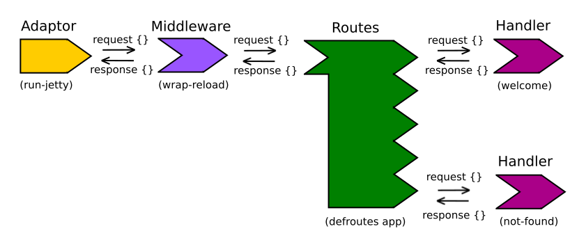

# Compojure

To make our webapp more useful we will add more functionality, which will require more routes.  We can use a library called Compojure to help us easily define routes and their associated handlers.

  [Compojure](https://github.com/weavejester/compojure) is a library that works with Ring to manage
  
  * **routing** - running different code depending on the URL path recieved 
  * **http method switching** - running different code based on the HTTP method (GET, POST, PUT, DELETE)

Based on the type of HTTP method and URL path requested, a specific value (evaluated function) is returned.

Compojure also has convienience functions that make ring responses easier to generate.

In this section we will update our project to use Compojure.



## Some background theory we will go through 

  This section is some theory you can read up on if you want more background.  Most of this we will cover in the following examples, so feel free to skip it until later.

### Routes

In compojure, each route is an HTTP method paired with a URL-matching pattern, an argument list, and a body.

```clojure
(defroutes myapp
  (GET "/" [] "Show something")
  (POST "/" [] "Create something")
  (PUT "/" [] "Replace something")
  (PATCH "/" [] "Modify Something")
  (DELETE "/" [] "Annihilate something")
  (OPTIONS "/" [] "Appease something")
  (HEAD "/" [] "Preview something"))
```

Compojure route definitions are just functions which accept request maps and return response maps:

```clojure
(myapp {:uri "/" :request-method :post})
; => {:status 200
;     :headers {"Content-Type" "text/html; charset=utf-8}
;     :body "Create Something"}
```

The body may be a function, which must accept the request as a parameter:

```clojure
(defroutes myapp
  (GET "/" [] (fn [req] "Do something with req")))
```

Or, you can just use the request directly:

```clojure
(defroutes myapp
  (GET "/" req "Do something with req"))
```

Route patterns may include named parameters:

```clojure
(defroutes myapp
  (GET "/hello/:name" [name] (str "Hello " name)))
```

You can adjust what each parameter matches by supplying a regex:

```clojure
(defroutes myapp
  (GET ["/file/:name.:ext" :name #".*", :ext #".*"] [name ext]
    (str "File: " name ext)))
```


## Resources 

* [Learn X in minutes - Compojure](http://learnxinyminutes.com/docs/compojure/)
* [Webapps with Compojure & OM](http://zaiste.net/2014/02/web_applications_in_clojure_all_the_way_with_compojure_and_om/)
* [StackOverflow - What's the “big idea” behind compojure routes?](http://stackoverflow.com/questions/3488353/whats-the-big-idea-behind-compojure-routes)
