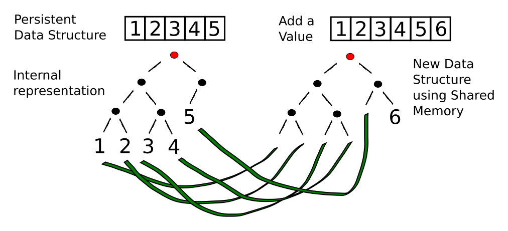

# Theory: Persistent Data Structures

Clojure has 4 built in data structures:

* **list** - simple linked list, the first element is assumed to be a function call
* **map** - a key value pair with keys often defined using Clojure keywords
* **vector** - an indexed array-like structure
* **set** - a unique set of elements, not ordered by default

Each of these data structures are immutable, so once they are created they cannot be changed.

When you run a function over these data structures then a new data structure is returned.  This keeps your code very simple as you can guarantee there are no side effects due to other parts of your code changing state.

## Sharing data

It may seem inefficient to create a new copy of a data structure each time, especially when working on very large data structure.  Clojure creates very efficient copies, by sharing elements from the original data structure.

> **Hint** Clojure manages data internally as a binary tree.  Read the [Polymathica article on Clojure Perisent Vectors](http://hypirion.com/musings/understanding-persistent-vector-pt-1) for more details.

